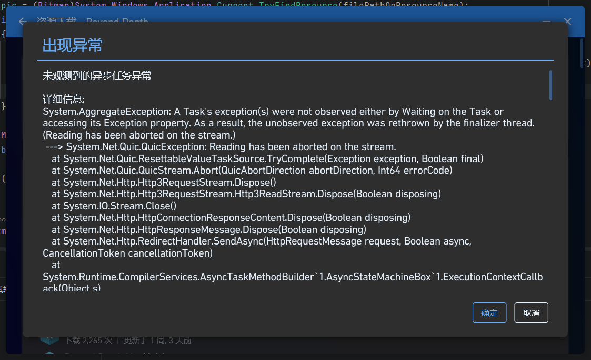

## 0. 起源

自从把 PCL CE 用 C# 重写之后，就总是在资源下载页面出现“未观测的异步任务异常”的报错。起初还以为是网络问题或个例，直到开始有用户[在 issues 反馈](https://github.com/PCL-Community/PCL-CE/issues/3226)



这种问题最烦人了，不能稳定触发，总是要吃那一点概率……但既然有 issue，得查啊。

## 1. 弹窗

先翻了翻源码，找到了构建才会弹出的异步任务异常弹框是从哪儿来的。在 `LifecycleFlow.cs` 里注册了这样一个处理器：

```csharp
TaskScheduler.UnobservedTaskException += (_, e) =>
{
    Context.Error("未观测到的异步任务异常", e.Exception);
    e.SetObserved();
};
```

正常来说，这个异常是不会弹出弹窗的，也只是因为我是源码构建，所以才会出现这个弹窗。正式版应该只有一个 hint


这边也给不知道的读者简单介绍一下未观测异常：`UnobservedTaskException` 的机制是：当一个 `Task` 出现异常，且这个异常既没人 await 它、也没人读它的 `.Exception` 属性时，在这个 Task 被 GC 回收、finalizer 运行的时候，异常会被重新抛出。

由于未观测到异常只有在 finalizer 运行时（也就是 exception 被 finalize 的时候）才会重新抛出，而通常来说，GC 只有在资源吃紧时才会运行，因此这个异常抛出的时候，可能与它产生的时候已经隔了十万八千里了，导致这个 bug 并不是每次都能成功复现，或者说可能需要很多次尝试才能够复现。

## 2. “翻页”……？

Issue 里写的重现路径很明确：社区资源页面翻页。我顺着这个交互找下去，定位到了 `PageComp.xaml.cs` 的翻页逻辑：

```csharp
private void ChangePage(int newPage)
{
    CardPages.IsEnabled = false;
    page = newPage;
    ModBase.RunInThread(() =>
    {
        Thread.Sleep(100);
        ModBase.RunInUi(() => CardPages.IsEnabled = true);
        loader.Start();   // 触发数据加载
    });
}
```

`loader.Start()` 会启动一个 `LoaderTask`，它内部用 `Task.Run` 执行数据抓取。

我一度怀疑是用户快速翻页时，旧的 `LoaderTask` 被取消，旧的 `Task` 丢了引用，导致取消产生的异常没人观测。于是我给这里加了点料，用 `ContinueWith` 观测旧 Task 的异常：

```csharp
oldTask.ContinueWith(
    static t => { _ = t.Exception; },
    TaskContinuationOptions.OnlyOnFaulted);
```

这个修复是对的，但它没解决问题。跑起测试环境试了试，还是会有这个问题，说明这 bug 跟这没关系……

## 3. 抓虫子！

在 `TaskScheduler.UnobservedTaskException` 那边打了个断点跑了一遍复现，发现异常出现时，紧挨着的是一批 **CDN 图片请求**：

```
[Request] Send request to https://cdn.modrinth.com/data/.../...webp (method = GET, id = ...)
[Request] Send request to https://media.forgecdn.net/avatars/thumbnails/.../...png (method = GET, id = ...)
...
[生命周期] 已忽略的网络层未观测异常
System.AggregateException: ... (Reading has been aborted on the stream.)
 ---> System.Net.Quic.QuicException: Reading has been aborted on the stream.
   at System.Net.Quic.ResettableValueTaskSource.TryComplete(...)
   at System.Net.Quic.QuicStream.Abort(...)
   at System.Net.Http.Http3RequestStream.Dispose()
   ...
```

其实我也猜到了是图片下载的问题。因为在翻页的时候，还有好一部分图片是没有加载完成的；并且由于图片的存在，日志里通常挤满了一堆图片下载请求的日志，同时 UI 会很卡。

（并且实际上，这个 bug 不翻页也能触发，只要在加载完成时快速滚动滚轮，就有概率导致图片加载被取消）

## 4. 奇怪的堆栈

这条堆栈看着有点奇怪，仔细看：

```
System.AggregateException: A Task's exception(s) were not observed either by Waiting on the Task or accessing its Exception property. As a result, the unobserved exception was rethrown by the finalizer thread. (Reading has been aborted on the stream.)
 ---> System.Net.Quic.QuicException: Reading has been aborted on the stream.
   at System.Net.Quic.ResettableValueTaskSource.TryComplete(Exception exception, Boolean final)
   at System.Net.Quic.QuicStream.Abort(QuicAbortDirection abortDirection, Int64 errorCode)
   at System.Net.Http.Http3RequestStream.Dispose()
   at System.Net.Http.Http3RequestStream.Http3ReadStream.Dispose(Boolean disposing)
   at System.IO.Stream.Close()
   at System.Net.Http.HttpConnectionResponseContent.Dispose(Boolean disposing)
   at System.Net.Http.HttpResponseMessage.Dispose(Boolean disposing)
   at System.Net.Http.RedirectHandler.SendAsync(HttpRequestMessage request, Boolean async, CancellationToken cancellationToken)
   at System.Runtime.CompilerServices.AsyncTaskMethodBuilder`1.AsyncStateMachineBox`1.ExecutionContextCallback(Object s)
   at System.Threading.ExecutionContext.RunInternal(ExecutionContext executionContext, ContextCallback callback, Object state)
   at System.Runtime.CompilerServices.AsyncTaskMethodBuilder`1.AsyncStateMachineBox`1.MoveNext(Thread threadPoolThread)
   at System.Runtime.CompilerServices.AsyncTaskMethodBuilder`1.AsyncStateMachineBox`1.MoveNext()
   at System.Threading.Tasks.AwaitTaskContinuation.RunOrScheduleAction(IAsyncStateMachineBox box, Boolean allowInlining)
   at System.Threading.Tasks.Task.RunContinuations(Object continuationObject)
   at System.Threading.Tasks.Task`1.TrySetResult(TResult result)
   at System.Runtime.CompilerServices.AsyncTaskMethodBuilder`1.SetExistingTaskResult(Task`1 task, TResult result)
   at System.Net.Http.HttpConnectionPool.SendWithVersionDetectionAndRetryAsync(HttpRequestMessage request, Boolean async, Boolean doRequestAuth, CancellationToken cancellationToken)
   at System.Runtime.CompilerServices.AsyncTaskMethodBuilder`1.AsyncStateMachineBox`1.ExecutionContextCallback(Object s)
   at System.Threading.ExecutionContext.RunInternal(ExecutionContext executionContext, ContextCallback callback, Object state)
   at System.Runtime.CompilerServices.AsyncTaskMethodBuilder`1.AsyncStateMachineBox`1.MoveNext(Thread threadPoolThread)
   at System.Runtime.CompilerServices.AsyncTaskMethodBuilder`1.AsyncStateMachineBox`1.MoveNext()
   at System.Threading.Tasks.AwaitTaskContinuation.RunOrScheduleAction(IAsyncStateMachineBox box, Boolean allowInlining)
   at System.Threading.Tasks.Task.RunContinuations(Object continuationObject)
   at System.Threading.Tasks.Task`1.TrySetResult(TResult result)
   at System.Runtime.CompilerServices.AsyncTaskMethodBuilder`1.SetExistingTaskResult(Task`1 task, TResult result)
   at System.Net.Http.HttpConnectionPool.TrySendUsingHttp3Async(HttpRequestMessage request, CancellationToken cancellationToken)
   at System.Runtime.CompilerServices.AsyncTaskMethodBuilder`1.AsyncStateMachineBox`1.ExecutionContextCallback(Object s)
   at System.Threading.ExecutionContext.RunInternal(ExecutionContext executionContext, ContextCallback callback, Object state)
   at System.Runtime.CompilerServices.AsyncTaskMethodBuilder`1.AsyncStateMachineBox`1.MoveNext(Thread threadPoolThread)
   at System.Runtime.CompilerServices.AsyncTaskMethodBuilder`1.AsyncStateMachineBox`1.MoveNext()
   at System.Threading.Tasks.AwaitTaskContinuation.RunOrScheduleAction(IAsyncStateMachineBox box, Boolean allowInlining)
   at System.Threading.Tasks.Task.RunContinuations(Object continuationObject)
   at System.Threading.Tasks.Task`1.TrySetResult(TResult result)
   at System.Runtime.CompilerServices.AsyncTaskMethodBuilder`1.SetExistingTaskResult(Task`1 task, TResult result)
   at System.Net.Http.Http3Connection.SendAsync(HttpRequestMessage request, Int64 queueStartingTimestamp, CancellationToken cancellationToken)
   at System.Runtime.CompilerServices.AsyncTaskMethodBuilder`1.AsyncStateMachineBox`1.ExecutionContextCallback(Object s)
   at System.Threading.ExecutionContext.RunInternal(ExecutionContext executionContext, ContextCallback callback, Object state)
   at System.Runtime.CompilerServices.AsyncTaskMethodBuilder`1.AsyncStateMachineBox`1.MoveNext(Thread threadPoolThread)
   at System.Runtime.CompilerServices.AsyncTaskMethodBuilder`1.AsyncStateMachineBox`1.MoveNext()
   at System.Threading.Tasks.AwaitTaskContinuation.RunOrScheduleAction(IAsyncStateMachineBox box, Boolean allowInlining)
   at System.Threading.Tasks.Task.RunContinuations(Object continuationObject)
   at System.Threading.Tasks.Task`1.TrySetResult(TResult result)
   at System.Runtime.CompilerServices.AsyncTaskMethodBuilder`1.SetExistingTaskResult(Task`1 task, TResult result)
   at System.Net.Http.Http3RequestStream.SendAsync(CancellationToken cancellationToken)
   at System.Runtime.CompilerServices.AsyncTaskMethodBuilder`1.AsyncStateMachineBox`1.ExecutionContextCallback(Object s)
   at System.Threading.ExecutionContext.RunInternal(ExecutionContext executionContext, ContextCallback callback, Object state)
   at System.Runtime.CompilerServices.AsyncTaskMethodBuilder`1.AsyncStateMachineBox`1.MoveNext(Thread threadPoolThread)
   at System.Runtime.CompilerServices.AsyncTaskMethodBuilder`1.AsyncStateMachineBox`1.MoveNext()
   at System.Threading.Tasks.AwaitTaskContinuation.RunOrScheduleAction(IAsyncStateMachineBox box, Boolean allowInlining)
   at System.Threading.Tasks.Task.RunContinuations(Object continuationObject)
   at System.Threading.Tasks.Task`1.TrySetResult(TResult result)
   at System.Runtime.CompilerServices.AsyncTaskMethodBuilder`1.SetExistingTaskResult(Task`1 task, TResult result)
   at System.Runtime.CompilerServices.AsyncTaskMethodBuilder.SetResult()
   at System.Net.Http.Http3RequestStream.ReadResponseAsync(CancellationToken cancellationToken)
   at System.Runtime.CompilerServices.AsyncTaskMethodBuilder`1.AsyncStateMachineBox`1.ExecutionContextCallback(Object s)
   at System.Threading.ExecutionContext.RunInternal(ExecutionContext executionContext, ContextCallback callback, Object state)
   at System.Runtime.CompilerServices.AsyncTaskMethodBuilder`1.AsyncStateMachineBox`1.MoveNext(Thread threadPoolThread)
   at System.Runtime.CompilerServices.AsyncTaskMethodBuilder`1.AsyncStateMachineBox`1.MoveNext()
   at System.Threading.Tasks.AwaitTaskContinuation.RunOrScheduleAction(IAsyncStateMachineBox box, Boolean allowInlining)
   at System.Threading.Tasks.Task.RunContinuations(Object continuationObject)
   at System.Threading.Tasks.Task`1.TrySetResult(TResult result)
   at System.Runtime.CompilerServices.AsyncTaskMethodBuilder`1.SetExistingTaskResult(Task`1 task, TResult result)
   at System.Runtime.CompilerServices.AsyncValueTaskMethodBuilder`1.SetResult(TResult result)
   at System.Net.Http.Http3RequestStream.ReadFrameEnvelopeAsync(CancellationToken cancellationToken)
   at System.Runtime.CompilerServices.AsyncTaskMethodBuilder`1.AsyncStateMachineBox`1.ExecutionContextCallback(Object s)
   at System.Threading.ExecutionContext.RunInternal(ExecutionContext executionContext, ContextCallback callback, Object state)
   at System.Runtime.CompilerServices.AsyncTaskMethodBuilder`1.AsyncStateMachineBox`1.MoveNext(Thread threadPoolThread)
   at System.Runtime.CompilerServices.AsyncTaskMethodBuilder`1.AsyncStateMachineBox`1.MoveNext()
   at System.Threading.Tasks.AwaitTaskContinuation.RunOrScheduleAction(IAsyncStateMachineBox box, Boolean allowInlining)
   at System.Threading.Tasks.Task.RunContinuations(Object continuationObject)
   at System.Threading.Tasks.Task`1.TrySetResult(TResult result)
   at System.Runtime.CompilerServices.AsyncTaskMethodBuilder`1.SetExistingTaskResult(Task`1 task, TResult result)
   at System.Net.Quic.QuicStream.ReadAsync(Memory`1 buffer, CancellationToken cancellationToken)
   at System.Runtime.CompilerServices.AsyncTaskMethodBuilder`1.AsyncStateMachineBox`1.ExecutionContextCallback(Object s)
   at System.Threading.ExecutionContext.RunFromThreadPoolDispatchLoop(Thread threadPoolThread, ExecutionContext executionContext, ContextCallback callback, Object state)
   at System.Runtime.CompilerServices.AsyncTaskMethodBuilder`1.AsyncStateMachineBox`1.MoveNext(Thread threadPoolThread)
   at System.Runtime.CompilerServices.AsyncTaskMethodBuilder`1.AsyncStateMachineBox`1.ExecuteFromThreadPool(Thread threadPoolThread)
   at System.Threading.ThreadPoolWorkQueue.Dispatch()
   at System.Threading.PortableThreadPool.WorkerThread.WorkerThreadStart()
   at System.Threading.Thread.StartCallback()

```

一眼瞄过去就不对，这个 exception 的调用堆栈里头根本没有应用层，全是 `System`，看起来很奇怪啊。

到这里我就开始怀疑是上层的问题。毕竟一个“正常的（或者说常见的）异常”多少都会有一些应用层的调用。如果连应用层调用都没有，说明这个异常应该是运行时内部的问题。于是我就上网搜了搜。

## 5. 求助 Google

实在想不出法子，于是去 Google 了下，搜索结果里最相关的是 `dotnet/runtime#114128`：

> **TaskScheduler.UnobservedTaskException catches quic exceptions with kestrel combined with grpc + http3**

标题说是 Kestrel，跟我这 WPF 没啥关系，但症状和我这边的 bug 完全一致，仔细看了下也确实是同一个原因。

虽然找到了 issue，却发现这个 issue 是已完成的状态。修复 PR #114226 合并于 2025-04-15，是一年前的事，属于 .NET 10.0 Milestone。也就是说，**这个问题在 .NET 10 就修了，但 PCL CE 还是 .NET 8**

## 6. 图片下载

去改了改代码，把图片下载暂时禁用了，果然这个问题就没了

真凶找到了，但还有一个问题：**为什么偏偏是图片下载触发的？**其他 HTTP 请求就没见这个问题，偏只有图片会这样。

注意到在 `MyImage.cs` 的图片下载里，有一行代码：

```csharp
using (var response = await HttpRequest.Create(url)
           .WithHttpVersionOption(HttpVersion.Version30)   // ← 强制 HTTP/3
           .SendAsync(addMetedata: false))
```

只有图片下载**强制走 HTTP/3**。我也不知道为啥会这样干，本来想去群里问问糖鸽的，但是已经半夜了，应该没人会理我（

## 7. 修复

到这里，修复方案有两条路：

1. **升级到 .NET 10**
2. **禁用强制 HTTP/3**

由于用户在不同的系统版本分布比较多，升级 .NET 10 短期内比较难，于是我提交了 [PR #3243](https://github.com/PCL-Community/PCL-CE/pull/3243)：移除 `MyImage.cs` 里那一行 `.WithHttpVersionOption(HttpVersion.Version30)`。

```diff
 using (var response = await HttpRequest.Create(url)
-           .WithHttpVersionOption(HttpVersion.Version30)
            .SendAsync(addMetedata: false))
```